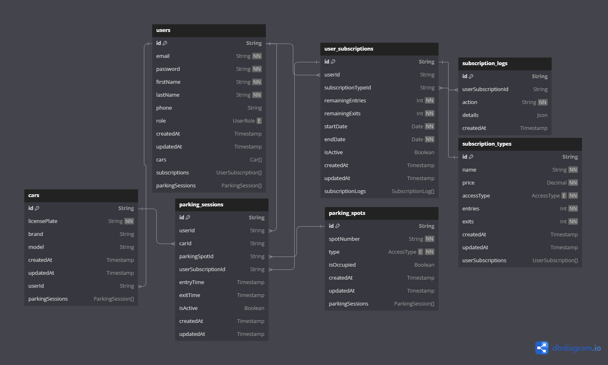

# Parking Project

## Description
**Parking Project** is a membership-based parking application designed to streamline parking management through a subscription model. The application aims to provide users with a seamless and efficient experience, enabling better organization and management of parking spaces.

## Features
- Subscription-based parking management.
- Backend powered by modern technologies for scalability and reliability.

## Technologies Used
- **Backend**: Node.js
- **ORM**: Prisma
- **Database Management**: pgAdmin
- **Development Environment**: Visual Studio Code (VS Code)
- **Database**: PostgreSQL
- **Testing**: CRUD routes tested with PostgreSQL

## Installation

### Prerequisites
- [Node.js](https://nodejs.org/) installed on your machine.
- [PostgreSQL](https://www.postgresql.org/) (or another database supported by Prisma).


##
# Project Documentation

## Setup project

Before starting, ensure all required dependencies are installed. Run the following command
```bash
 npm install
```
This will install all the packages specified in the **package.json** file.

## Compile and run the project

To start the project in development mode, use the following command

 ```bash
# development
 npm run start:dev
 ```

```bash
# production mode
 npm run start

 # build
 npm run build
```

## Apply Seed Data

To populate the database with initial data, run

```bash
 npm run seed
```
This command will execute the predefined seed scripts, setting up test data for development or testing purposes.

## Database Migration

```bash
# create a new migration
 npm run db:migrate:dev

# generate Prisma types
 npm run db:generate

 #  apply the migration to the database
 npm run db:migrate:run

```

## Code Formatting and Linting

- Code Formatting with Prettier: format the codebase to ensure uniform styling
```bash
# prettier
npm run format
```
- Linting with ESLint: identify and fix code quality issues


```
# ESLint
 npm run lint
```

## Database Overview

Below is a representation of the parking database schema



**This schema illustrates the structure of the parking system, including tables, relationships, and fields crucial for managing subscriptions, users, and parking slots.**

##
<p align="center">
  <a href="http://nestjs.com/" target="blank"></a>
</p>

[circleci-image]: https://img.shields.io/circleci/build/github/nestjs/nest/master?token=abc123def456
[circleci-url]: https://circleci.com/gh/nestjs/nest

  <p align="center">A progressive <a href="http://nodejs.org" target="_blank">Node.js</a> framework for building efficient and scalable server-side applications.</p>
    <p align="center">
<a href="https://www.npmjs.com/~nestjscore" target="_blank"></a>
<a href="https://www.npmjs.com/~nestjscore" target="_blank"></a>
<a href="https://www.npmjs.com/~nestjscore" target="_blank"></a>
<a href="https://circleci.com/gh/nestjs/nest" target="_blank"></a>
<a href="https://coveralls.io/github/nestjs/nest?branch=master" target="_blank"></a>
<a href="https://discord.gg/G7Qnnhy" target="_blank"></a>
<a href="https://opencollective.com/nest#backer" target="_blank"></a>
<a href="https://opencollective.com/nest#sponsor" target="_blank"></a>
  <a href="https://paypal.me/kamilmysliwiec" target="_blank"></a>
    <a href="https://opencollective.com/nest#sponsor"  target="_blank"></a>
  <a href="https://twitter.com/nestframework" target="_blank"></a>
</p>
